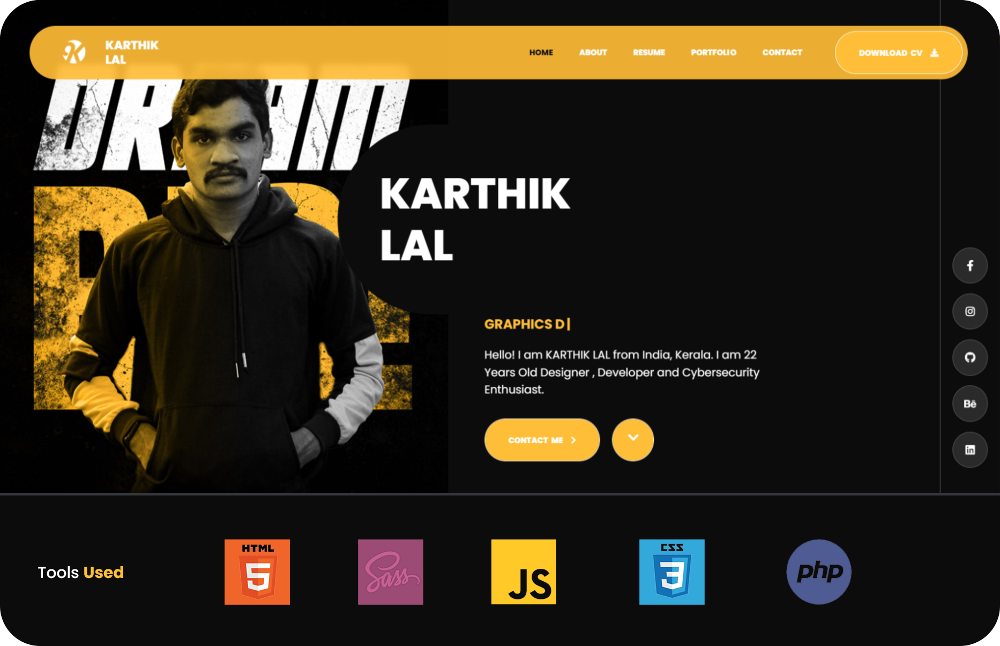

## <b> MAIN PAGE & 404 PAGE <i>(PREVIEW) </b></i>
<!-- HEADER IMAGE SRC -->

<!-- 404 IMAGE SRC -->

## <b> PORTFOLIO FEATURES </b>
* <b>Image</b> based portfolio (accent matching with the image)
* Blocked <b>incepting</b> site (no incepting) (security.js)
* <b>Beautiful</b> and <b>responsive design</b> (javascript)(sass)(css)(html)
* <b>Responsive</b> and <b>mobile friendly</b>
* Using <b>Swiper.js</b> (slider) (slideshow) and <b>Carousel.js </b>(carousel)
* Custom <b>404 Page</b> (Matching with the hex color of subject)
* Using <b>jQuery.js</b> (animation) (ajax) (json) (xml) (html)

## <b> SPECIAL THANKS </b>
* <b>Adobe Photoshop, Figma, Envato, Freepik</b> (UI Designing)
* <b>Namecheap</b> (Domain)
* <b>Vercel & Github</b> (Hosting)
* <b>Cloudflare</b> (DDoS Protection)

## <b> CONTRIBUTION AND LICENCE </b>

* If you want to contribute to this project, then follow github-basic-contribution rules. (inlude signoff and commit message) (https://help.github.com/en/github collaborating-with-issues-and-pull-requests/writing-a-pull-request).
* LICESNSE: GNU GENERAL PUBLIC LICENSE V3.0.
* OPENSOURCE SOFTWARE LICENSE AGREEMENT FOR WINDOWS DISTRIBUTION SYSTEM (https://www.gnu.org/licenses/gpl-3.0.en.html).
* Copying and distribution of this file, with or without modification, are permitted in any medium without royalty provided the copyright notice and this notice are preserved.
* <b> Copyright (c) 2022, <i> KARTHIK LAL</i>. All rights reserved.