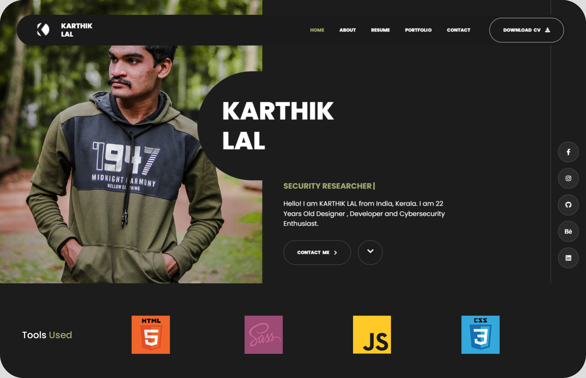

## <b> PORTFOLIO FEATURES </b>
* Image based portfolio (accent matching with the image)
* Blocked incepting site (no incepting) (security.js)
* Beautiful and responsive design (sass) (css) (html)
* Responsive and mobile friendly
* Using Swiper.js (slider) (slideshow) and Carousel.js (carousel)
* Using jQuery.js (animation) (ajax) (json) (xml) (html)

## <b> SPECIAL THANKS </b>
* Adobe Photoshop, Figma, Envato, Freepik (UI Designing)
* Namecheap (Domain)
* Vercel & Github (Hosting)
* Cloudflare (DDoS Protection)

## <b> CONTRIBUTION AND LICENCE </b>

* If you want to contribute to this project, then follow github-basic-contribution rules. (inlude signoff and commit message) (https://help.github.com/en/github collaborating-with-issues-and-pull-requests/writing-a-pull-request).
* LICESNSE: GNU GENERAL PUBLIC LICENSE V3.0.
* OPENSOURCE SOFTWARE LICENSE AGREEMENT FOR WINDOWS DISTRIBUTION SYSTEM (https://www.gnu.org/licenses/gpl-3.0.en.html).
* Copying and distribution of this file, with or without modification, are permitted in any medium without royalty provided the copyright notice and this notice are preserved.
* Copyright (c) 2022, KARTHIK LAL. All rights reserved.